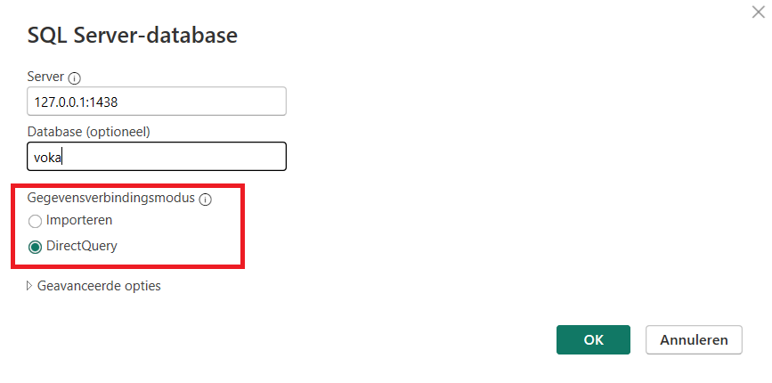

# DEP2-GROEP-1

## Demo

### Epic 3

```python
https://dep2-g1.vichogent.be/contact?ids=373B8AE4-5512-E811-80EF-001DD8B72B61,AEE24758-1073-E111-B43A-00505680000A
```


### Epic 5

```python
https://dep2-g1.vichogent.be/campagne?id=6589DBEF-0CBC-ED11-83FF-6045BD895D85
```


```sql
select * from Campagne
where CampagneId = '6589DBEF-0CBC-ED11-83FF-6045BD895D85'

select * from Persoon
where PersoonId = 'F49C652D-F83D-EB11-8116-001DD8B72B61'
```

## SQL Server Management Studio

### Server starten

```sh
pwd
# ./DEP2-GROEP-1
cd sqlserver
docker-compose up -d
```

Als er problemen zijn check of de _end of line sequence_ op `LF` staat.

Connecteren met SQL server:


Connect met database in Container

`sudo docker exec -t sqlserver-db /opt/mssql-tools/bin/sqlcmd -S localhost -U SA -P 'Password123*'`

Connecteren met de database gebruik makend van mssql-cli (broken)

`mssql-cli -S localhost -U SA -P 'Password123*' -d voka`

Connecteren met de database gebruik makend van sqlcmd

`sqlcmd -S localhost -U SA -P 'Password123*'`

## Connect lokaal met de DB op VIC

Link de lokale poort 1438 met poort 1433 op de VM door middel van een ssh tunnel

```
ssh -p 40095 -L 1438:localhost:1433 vicuser@vichogent.be
```

Open lokaal SSMS en log als volgt in.


# PowerBI

Link de lokale poort 1438 met poort 1433 op de VM door middel van een ssh tunnel

```
ssh -p 40095 -L 1438:localhost:1433 vicuser@vichogent.be
```

Open daarna PowerBI en selecteer 'Import data from SQL Server'.


maak lokaal connectie met poort 1438 om te connecteren met de database op de VM.



Geef bij 'Database' de gebruikersnaam en het wachtwoord op en connecteer.


je kan een melding krijgen over een connectie die niet encrypted is.

# Python setup

```console
python -m venv venv
.\venv\Scripts\activate
pip install -r .\requirements.txt
```

## Python scripts usage

```
python .\src\main.py
```

De helpt tekst die ge krijgt spreekt voor zich.

# .ENV

Voorbleed

```env
DB_URL=mssql+pyodbc://I-400/voka?trusted_connection=yes&driver=ODBC+Driver+17+for+SQL+Server
DATA_PATH=../Data
```

# Data folder

alles csv's in de de root van de DATA_PATH folder

# API Server

start dev-server

```
uvicorn app.main:app --reload --app-dir ./FastAPI
```
